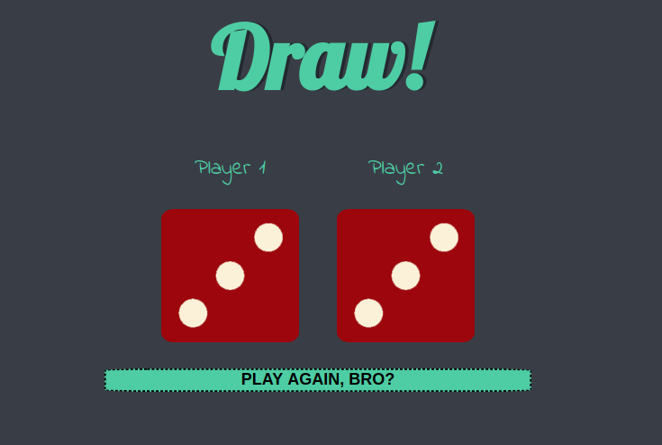

# dice-game

This is a simple javascript exercise, in which you can play your luck at a dice game. As you press play, the 2 dice will show a number in the range of 1~6 and the player whose dice shows a bigger number wins.

Wanna play? Grab your friend and check it out at https://negoprograma.github.io/dice-game/index

